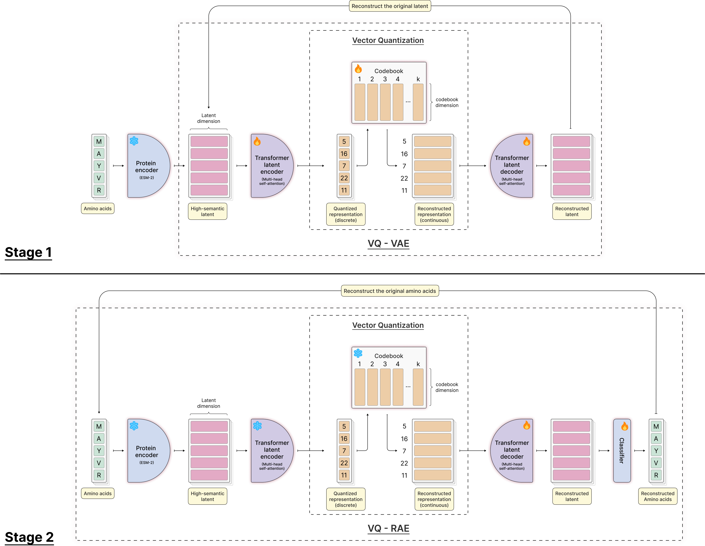
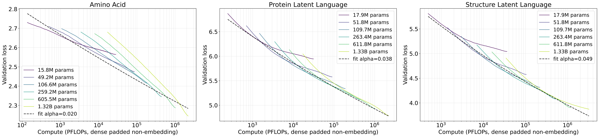

# Learning Latent Protein Languages for Autoregressive Generation

Mahdi Pourmirzaei, Farzaneh Esmaili, Amir Ziashahabi, Mohammadreza Pourmirzaei, and Dong Xu

[Project website](https://mahdip72.github.io/latent-protein-languages.github.io/) · [Paper (arXiv:2610.03978)](https://arxiv.org/abs/2610.03978)

## Abstract

Autoregressive transformers are the dominant generative recipe across most tokenized modalities, yet they remain comparatively weak for protein sequence and structure generation. We study the role of target representation in this gap: amino acid tokens encode residue identities without explicit contextual semantics, while backbone coordinates require a discrete representation in our framework. We introduce two learned latent protein languages. *Protein Latent Language* (PLL) maps sequences into a 4,096-state contextual alphabet built on a frozen ESM-2 encoder, retaining one token per residue. *Structure Latent Language* (SLL) adapts GCP-VQVAE Lite with auxiliary sequence and confidence supervision while preserving decoding to backbone coordinates. We separately pretrain autoregressive transformer language models on PLL and SLL tokens using a next-token prediction objective, yielding PLLM and SLLM. Under matched downstream sequence training, PLLM has a fitted compute-scaling exponent of 0.038 versus 0.020 for the amino acid autoregressive protein language model (PLM), a roughly 1.9× steeper slope. SLLM has a fitted exponent of 0.049 on structure-token data. In unconditional sequence generation, PLLM substantially reduces the fraction of samples below a heuristic 1.5-bit residue-composition entropy threshold by 54% relative to the amino acid model across a sweep of sampling temperatures. At moderate sampling temperatures, PLLM better matches the sequence lengths and residue-composition entropy of the UniRef50 training data than PLM does. SLL improves performance on supervised protein structure tasks. For sequence-to-structure prediction, replacing the original GCP-VQVAE Lite tokenizer with SLL reduces best validation perplexity by 34% under matched training. In backbone generation, SLLM compares favorably with other generative models on diversity and novelty. We further use SLLM for sequence-to-structure prediction, where latent-token sampling for long proteins is approximately 1000 times faster than MSA-based AlphaFold2 in our measurements, and we observe early signs that using the model's own internal token confidence for inference-time scaling can lift prediction quality beyond a single decoded sample. Together, these results position learned latent protein languages as a promising direction for language modeling to explore, offering a practical substrate for bringing autoregressive transformer scaling and inference-time sampling to protein generation.

## PLL tokenizer



Stage 1 learns a quantized representation of frozen ESM-2 features. Stage 2 freezes the latent encoder and codebook and trains a reinitialized transformer decoder with a linear residue-classification head to recover amino acid sequences.

## Scaling laws



Validation loss versus estimated downstream autoregressive training compute. Under matched sequence training, PLLM has a fitted scaling exponent of 0.038 versus 0.020 for the amino acid PLM, a roughly 1.9× steeper slope. SLLM has a fitted exponent of 0.049 on structure-token data with different training exposure. Absolute cross-entropy values across vocabularies are not a common quality scale.

## Code

| Folder | What it contains | Start here |
| --- | --- | --- |
| [ProteinLatentLanguage](ProteinLatentLanguage/) | The PLL tokenizer. Train the contextual codebook, train its transformer residue decoder, encode sequences, and decode PLL tokens to amino acids. | [Tokenizer guide](ProteinLatentLanguage/README.md) |
| [ProteinLanguageModel](ProteinLanguageModel/) | Autoregressive next-token training for amino acid PLM, PLLM, and SLLM. Includes length-conditioned continuation, E1-conditioned sequence-to-structure training, and inference. | [Language-model guide](ProteinLanguageModel/README.md) |

SLL tokenizer training and its GCP-VQVAE implementation are maintained separately in [vq_encoder_decoder](https://github.com/mahdip72/vq_encoder_decoder). Structure tokens and coordinates require the tokenizer checkpoint that was used to create the training targets. The SLL tokenizer comparison and the larger E1-conditioned generation experiments are separate experiments.

## Getting started

Use Python 3.10 or later in a Linux environment with a CUDA-enabled PyTorch installation. Create a separate environment for each folder, then follow its guide. Run training and inference commands from inside that folder because the original projects use local `models`, `utils`, and `data` imports.

The release contains source code and saved training configurations. Datasets and trained checkpoints are not bundled, and public download URLs are not yet available. Point the configurations at your datasets and checkpoint directories before running them.

Saved configurations retain the recorded training parameters, including model sizes, batch sizes, optimization, and modality settings. Paths have been made portable. New training runs receive new timestamps, so continuation `resume_path` values must point to the checkpoints you actually produced.

See [EXPERIMENTS.md](EXPERIMENTS.md) for the original run mapping, data formats, checkpoint lineage, and the coverage of this source release. [provenance.json](provenance.json) records the archived source revisions, source hashes, configuration origins, and the small release adaptations.

ProteinBench pipelines, external baseline implementations, plotting scripts, chemical-model experiments, and trained result files are outside this repository's scope.

## License

The code in this repository is released under the [MIT license](LICENSE). Pretrained models and datasets retain their respective licenses.

## Citation

If you use this work, please cite:

```bibtex
@misc{pourmirzaei2026latent,
  title={Learning Latent Protein Languages for Autoregressive Generation},
  author={Pourmirzaei, Mahdi and Esmaili, Farzaneh and Ziashahabi, Amir
          and Pourmirzaei, Mohammadreza and Xu, Dong},
  year={2026},
  eprint={2610.03978},
  archivePrefix={arXiv},
  primaryClass={cs.LG},
  url={https://arxiv.org/abs/2610.03978}
}
```
